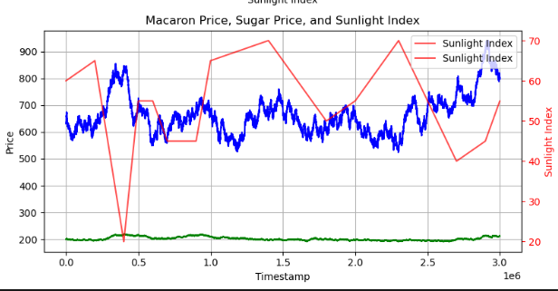
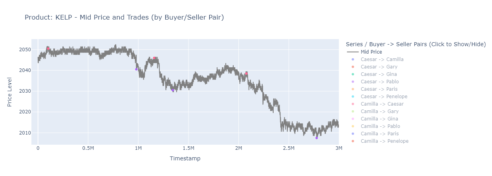

# IMC Prosperity 3 - Algorithmic Trading Strategies - Team POJ

**Final Rank: 356th Global, 16th Netherlands**

## Overview

This repository contains the algorithmic trading strategies, analysis tools, and documentation developed by my solo/duo **Team POJ** for the [IMC Prosperity 3](https://imc-prosperity.notion.site/Prosperity-3-Documentation-19ee8453a0938100a71f3ae712d350b0) competition. Sina had to drop out before the competition started, and Arman could only help briefly in round 2 and 5 due to his busy schedule, making this largely a solo effort.

My goal was to develop profitable and robust trading algorithms by leveraging data analysis, simulation, and rapid iteration. This repository serves as my central hub for code, documentation, and research findings.

## Repository Structure

*   `README.md`: (This file) Project overview, round-by-round breakdown, and reflections.
*   `strategy/`: Contains the core Python code and simulation logs for the trading strategies submitted each round.
*   `docs/`: Holds detailed documentation:
    *   `COMPETITION_INFO.md`: Summary of competition rules, links, mechanics, and product details.
    *   `STRATEGY_OVERVIEW.md`: (Planned) Description of the trading strategies employed.
    *   `DATA_MODEL.md`: (Planned) Explanation of key data structures used by the platform.
*   `notebooks&analysis/`: Jupyter notebooks for data analysis, visualization, strategy experimentation, and results exploration.
*   `dashboards/`: Code for a custom dashboard built to visualize simulation logs and historical data, providing alternative analysis perspectives.

---

## Competition Log & Strategy Evolution

### Preparation (Tutorial Round)

*   **Products:** `RAINFOREST_RESIN`, `KELP`
*   **Focus:** During the tutorial round, I mostly spent my time understanding the mechanics of the competition and the simulation environment. I tested out some basic strategies with the tutorial products (`RAINFOREST_RESIN`, `KELP`) and familiarized myself with the platform.
*   **Tools & Analysis:** Jasper Merle's open-source [visualizer](https://jmerle.github.io/imc-prosperity-3-visualizer/) was very helpful in analyzing the performance of the strategies. However, I also spent time during the tutorial developing a **custom dashboard** to get different perspectives for analyzing my strategies. My dashboard also visualized the historical data bottle provided at the start of each round, allowing for more intuitive data analysis.
*   **Research:** I checked out previous years' repositories (Prosperity 1 & 2) to understand the strategies other successful teams used.

### Round 1: Mean Reversion and a Costly Mistake

*   **New Product:** `SQUID_INK`
*   **Products Traded:** `RAINFOREST_RESIN`, `KELP`, `SQUID_INK`
*   **Observations:**
    *   `RAINFOREST_RESIN`: Stable, trading around a fair value of 10,000.
    *   `KELP`: More volatile; my analysis suggested random walk behavior.
    *   `SQUID_INK`: Much more volatile, with large price swings. Hints suggested mean-reverting behavior.
*   **Strategies Implemented:**
    *   **`RAINFOREST_RESIN`:** A two-phase strategy:
        1.  *Taking:* Aggressively take ask orders below 10,000 and bid orders above 10,000.
        2.  *Market Making:* Conduct simple market making around the 10,000 fair value. *Refinement:* Analysis of market microstructure showed that best bid/ask volumes were often small (<= 6 units). I implemented logic to *join* the queue at the best price when volume was low, rather than pennying, which proved more profitable due to better fill rates.
    *   **`KELP`:** Simple market making strategy around a fair value calculated using the mid-point of the *most popular* bid and ask levels (those with the highest volume). Attempts at trend-following or standard mean-reversion strategies were less effective.
    *   **`SQUID_INK`:** Analysis confirmed likely mean reversion after large swings (later supported by moderator hints). 
        *   *Initial Attempt:* Tried a mean reversion strategy using SMA + rolling Z-scores, but struggled to make it consistently profitable.
        *   *Implemented Strategy:* Switched to a simple RSI strategy, optimizing parameters (`rsi_window`, `rsi_overbought`, `rsi_oversold`) using historical data. This strategy was profitable, although I suspect a well-tuned SMA + Z-score approach could have performed better.
*   **Manual Trading Part:** The manual task involved a series of currency conversions. It was deterministic and relatively straightforward. I brute-forced the optimal sequence of trades to maximize profit.
*   **Results & Reflection:**
    *   Round 1 results were hectic. I realized *after* the submission deadline that I had uploaded the wrong algorithm file.
    *   Initial scoring placed me 251st globally.
    *   However, the test data was compromised and subsequently replaced. The rescore on new data dropped my rank drastically to 852nd.
    *   Had the correct file been submitted, I would have been in the top 50 globally.
    *   The manual part yielded maximum profit, as expected for a deterministic task.
    *   This initial setback was discouraging, but I decided to persevere.

*   

---

### Round 2: Basket Deviation Arbitrage

*   **New Products:** `PICNIC_BASKET1`, `PICNIC_BASKET2`, `CROISSANTS`, `JAMS`, `DJEMBES`
*   **Product Relationships:**
    *   `PICNIC_BASKET1` = 6 `CROISSANTS` + 3 `JAMS` + 1 `DJEMBE`
    *   `PICNIC_BASKET2` = 4 `CROISSANTS` + 2 `JAMS`
    *   Theoretical Spread (`BASKET1` - `BASKET2`) = 2 `CROISSANTS` + 1 `JAM` + 1 `DJEMBE`
*   **Analysis & Strategy:**
    *   Analyzed individual basket premiums (Market Price - Theoretical Value). Found they were mean-reverting, but trading them separately posed hedging challenges if signals conflicted.
    *   Analyzed the **deviation** between the *market spread* (`PICNIC_BASKET1` Price - `PICNIC_BASKET2` Price) and the *theoretical spread* (calculated using component mid-prices: 2C + 1J + 1D).
    *   This **spread deviation** showed strong mean-reversion characteristics with higher confidence.
    *   **Implemented Strategy:** Traded this Basket Deviation Spread.
        *   Calculated the deviation at each timestamp.
        *   Used a rolling Z-score (based on a rolling standard deviation and historical mean of the deviation) to generate signals.
        *   *Entry Logic:* Sell the deviation (Short B1, Long B2, Long Components) when Z-score was high (above `zscore_threshold_entry`); Buy the deviation (Long B1, Short B2, Short Components) when Z-score was low (below `-zscore_threshold_entry`).
        *   *Exit Logic:* Close the position when Z-score crossed back towards zero (below `zscore_threshold_exit` if short, above `-zscore_threshold_exit` if long).
        *   This strategy maintained a perfect hedge across the five related products.
        *   Parameters (rolling window, Z-score thresholds, target position size) were tuned using an optimizer script (`strategy/round2/optimizer_b1b2_deviation.py`) against historical data.
*   **Manual Trading Part:** A container selection game. Choose up to two containers; the first was free, the second cost 50,000 SeaShells. Payout depended on a treasure multiplier, number of inhabitants choosing the same container, and the percentage of *all* players choosing that container. Analysis indicated that the potential dilution of rewards made opening a second container too risky for a likely profit. I chose to open only one (free) container.
*   **Results & Reflection:**
    *   The decision to continue after Round 1 paid off significantly.
    *   The Basket Deviation strategy was highly profitable (+70K).
    *   The conservative manual strategy (opening one container) proved correct.
    *   Rank jumped from 852nd to 256th globally.

*   

---

### Round 3: Volatility Trading and Unhedged Risk

*   **New Products:** `VOLCANIC_ROCK`, `VOLCANIC_ROCK_VOUCHER_*` (5 strikes: 9500, 9750, 10000, 10250, 10500). Vouchers behaved like near-expiry European call options.
*   **Strategy Development (Vouchers):**
    *   *Attempt 1 (Skew Arbitrage):* Tried to trade based on differences in Implied Volatility (IV) across different strikes (the volatility skew). Could not achieve stable profitability.
    *   *Attempt 2 (Residual IV Arbitrage):* Focused on the volatility smile.
        1.  Calculated moneyness for each voucher: \( m_t = \log(K/S_t) / \sqrt{TTE} \), where \( S_t \) is `VOLCANIC_ROCK` price, \( K \) is strike, TTE is time-to-expiry.
        2.  Calculated IV for each voucher using Black-Scholes: \( v_t = \text{ImpliedVol}(S_t, V_t, K, TTE) \), where \( V_t \) is the voucher market price.
        3.  Fitted a parabolic curve (volatility smile model) to the \( (m_t, v_t) \) data at each timestamp.
        4.  Calculated the IV residual for each voucher (Actual IV - IV predicted by the smile model).
        5.  *Strategy Idea:* Buy vouchers with large negative residuals (IV cheaper than model predicts), sell vouchers with large positive residuals (IV more expensive). *Challenge:* Failed to make this consistently profitable across historical data. *Hindsight:* Top teams likely used variations of this; perhaps my model or thresholds needed more refinement.
    *   *Implemented Strategy (Base IV Mean Reversion):*
        1.  Used the constant term (intercept) of the fitted parabolic smile as an estimate of the At-The-Money IV (Base IV).
        2.  Observed that this Base IV series exhibited mean-reverting behavior.
        3.  Generated signals using a Z-score based on the difference between a short-term EWMA and a long-term double EWMA of the Base IV.
        4.  *Trading Logic:* When Z-score was very low (below `-zscore_entry`), buy *all* vouchers. When Z-score was very high (above `zscore_entry`), sell *all* vouchers.
        5.  *Realization:* This strategy had **significant unhedged delta risk**. Being simultaneously long or short all vouchers exposed the portfolio heavily to directional moves in the underlying `VOLCANIC_ROCK` price. This risk didn't manifest negatively *in this round*, but would later.
*   **Strategy Development (`VOLCANIC_ROCK`):**
    *   Applied the same RSI strategy used for `SQUID_INK`.
    *   Backtesting showed immense profitability (almost 80k/day).
    *   *Decision:* Opted to run this highly profitable standalone strategy instead of attempting to delta-hedge the voucher positions due to its perceived edge. *Hindsight:* A major strategic error. The lack of trend detection logic meant the RSI strategy was vulnerable to strong directional moves.
*   **Manual Trading Part:** Bid for Sea Turtle Flippers. Reserve prices were uniform on [160, 200] U [250, 320]. A penalty applied to the second bid if it was below the average second bid across all players: \( p = (\frac{320 – \text{average bid}}{320 – \text{your bid}})^3 \). Flippers sold for 320.
    *   *Strategy:* Optimal first bid is 200. Nash equilibrium for the second bid is 285. Suspecting others might slightly undercut, I bid 296 for the second bid. The actual average was ~286, making my bid successful.
*   **Results & Reflection:**
    *   The risky, unhedged voucher strategy paid off *in this round* (+130k profit combined with Volcanic Rock RSI).
    *   Moved up to 230th globally. A manual scoring correction later improved this to 222nd globally (6th in NL).
    *   The success masked the underlying risks in the voucher and Volcanic Rock strategies.

*   
*   

---

### Round 4: Macarons and the Backtester Blind Spot

*   **New Product:** `MAGNIFICENT_MACARONS`
*   **Product Mechanics:** Value linked to observables (`sunlightIndex`, `sugarPrice`, tariffs, fees). Could be traded locally or converted (imported/exported) via an external market (Pristine Cuisine) at specific prices plus costs. **Crucial:** Any position held at the end of the trading day was forcibly converted at the *final timestamp's* conversion price.
*   **Strategy Development:**
    *   Focused *only* on the relationship between `MAGNIFICENT_MACARONS` price and the `sunlightIndex`.
    *   Developed a strategy buying/selling based on sunlight value and slope conditions.
    *   **Completely ignored** the conversion mechanism, external market prices, and the end-of-day forced conversion.
    *   **Backtesting Flaw:** The backtester used did **not** simulate the end-of-day forced conversion. My strategy appeared profitable in backtests for this reason.
    *   **Missed Opportunity:** The profitable strategy likely involved analyzing the spread between the local exchange price and the effective Pristine Cuisine conversion price (including fees/tariffs) and arbitraging this spread, potentially against bots providing liquidity near the break-even points.
*   **Results & Reflection:**
    *   A rollercoaster round.
    *   **Algo Loss (-30K):**
        *   The `MAGNIFICENT_MACARONS` strategy lost heavily because large positions were forcibly converted at unfavorable end-of-day prices.
        *   The unhedged Voucher (Base IV) strategy imploded as `VOLCANIC_ROCK` prices trended upwards while the strategy was often short vouchers.
    *   **Manual:** Performed well.
    *   **Overall Rank:** Dropped to 335th globally. This round starkly highlighted the dangers of incomplete backtesting and unhedged delta exposure.

*   

---

### Round 5: Counterparty Signals and Time Pressure

*   **New Feature:** De-anonymized market trades, revealing counterparty IDs (11 bots + own submission).
*   **Challenges:** This round coincided with international travel. Day 1 was lost to the flight, Day 2 to setting up a faulty backup PC. This left only Day 3 (the final day) for analysis, strategy adjustment, and submission.
*   **Strategy Triage (due to time constraints):**
    1.  **Disable Vouchers:** No time to develop a hedged options strategy. Disabled the `VOLATILITY_SMILE` strategy.
    2.  **Disable Macarons:** Conversion complexity and previous losses made it too risky to attempt a fix in one day.
    3.  **Focus:** Analyze counterparty trades in the remaining products for actionable signals.
*   **Counterparty Analysis:**
    *   Visualized trading activity for all bots across products.
    *   Identified bot **'Olivia'** consistently buying near daily lows and selling near daily highs in `CROISSANTS` and `KELP`. (Note: I missed that Olivia also exhibited this pattern in `SQUID_INK`).
*   **Implemented Strategy Changes:**
    *   **`CROISSANTS`:** Implement a simple signal strategy: Go full long when Olivia buys from bot 'Caesar', go full short when Olivia sells to 'Caesar'.
    *   **`KELP`:** Compared potential profits and decided my existing `PrototypeKelpStrategy` was likely better than mimicking Olivia.
    *   **Basket Conflict:** Trading `CROISSANTS` based on the Olivia signal broke the necessary hedge for the `B1B2_DEVIATION` (Basket Spread) strategy.
    *   **Decision:** Disabled the `B1B2_DEVIATION` strategy entirely, and stopped trading `JAMS`, `DJEMBES`, `PICNIC_BASKET1`, and `PICNIC_BASKET2`. *Retrospective:* This was a poor decision driven by fatigue and lack of time. A better approach, even under pressure, might have been to trade the baskets directionally based on the strong `CROISSANTS` signal (since it's the largest component) and hedge the smaller residual exposure in `JAMS`/`DJEMBES`.
    *   **`VOLCANIC_ROCK`:** Kept the RSI strategy running. *Retrospective:* A critical error. The price trended strongly upwards, causing the mean-reverting RSI strategy to lose heavily (-77k). Simply disabling this strategy would have resulted in a much higher final rank (likely top 150).
*   **Manual Trading Part:** Trade 9 products based on sentiment derived from a 'Goldberg' news terminal. Incurred quadratic fees based on portfolio allocation fraction (\( 	ext{Fee}(x) = 120x^2 \)). Arman handled the manual submission for this round.
*   **Results & Reflection:**
    *   A saddening end to the competition.
    *   Disabling Macarons and Vouchers was the correct risk management decision under the circumstances.
    *   However, disabling the Basket strategy and failing to disable the Volcanic Rock RSI strategy were significant errors.
    *   The algorithm barely broke even due to the -77k loss on Volcanic Rock offsetting gains elsewhere.
    *   Manual part profit was slightly above average.
    *   Final Rank: 356th globally, 16th in the Netherlands.

*   
*   
*   

---

## Overall Experience & Key Takeaways

This competition was an incredible, challenging, and rewarding experience. I met many helpful people in the community, learned a vast amount about algorithmic trading and market microstructure in a practical setting, and truly enjoyed the process. Competing essentially solo against larger, well-coordinated teams was demanding but pushed me to learn quickly.

**What Went Well:**

*   **Rapid Learning Curve:** Quickly adapted to the platform and developed foundational strategies for various product types.
*   **Analysis & Custom Tooling:** The effort invested in notebooks and the custom dashboard significantly aided in understanding data and strategy performance.
*   **Identifying Arbitrage (Round 2):** The successful identification and implementation of the Basket Deviation Spread strategy was a highlight and a major profit driver.
*   **Resilience:** Bouncing back mentally and in the rankings after the Round 1 disaster was crucial.

**What Could Have Been Better:**

*   **Risk Management & Hedging:** The failure to adequately hedge the delta risk in the voucher strategy and the lack of regime detection (trend vs. mean-reversion) in the Volcanic Rock RSI strategy were the most significant technical shortcomings, leading to large, avoidable losses.
*   **Backtesting Fidelity:** The Macaron incident underscored the absolute necessity of backtesting environments that replicate *all* critical exchange mechanics, including less obvious ones like end-of-day forced conversions.
*   **Decision-Making Under Pressure (Round 5):** While external factors were significant, the rushed decisions (disabling profitable basket spreads, keeping a strategy unsuitable for the market regime) highlighted the need for clearer mental frameworks or checklists for strategy triage, even with limited time.
*   **Solo Limitations:** The sheer volume of analysis, coding, debugging, and risk monitoring required, especially in later rounds with more products and complex interactions, made competing solo extremely difficult. Team bandwidth is a real advantage.

**Future Goals:**

This competition has solidified my interest in quantitative and algorithmic trading. I am determined to participate in IMC Prosperity again next year, ideally as part of a dedicated, full-stack team. The goal will be to apply the lessons learned here, particularly around rigorous risk management, comprehensive backtesting, and collaborative strategy development, aiming for a top-tier finish.

I would like to thank IMC and the competition moderators for organizing this fantastic event.

---

*Last Updated: 28/04/2025*
